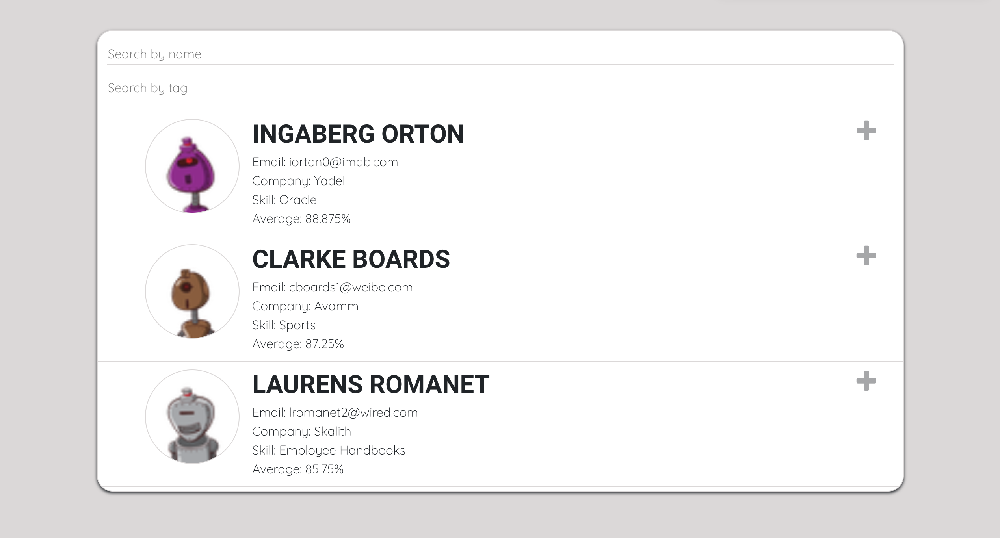

# Hatchways-app

## TechStack: React.JS

- Created with create-react-app
- Package manager:Yarn
- Github Repo: https://github.com/iris0617/student-app/tree/master/hatchways-app

### Steps to run this app : )

1. cd to this folder
2. yarn install
3. yarn start

